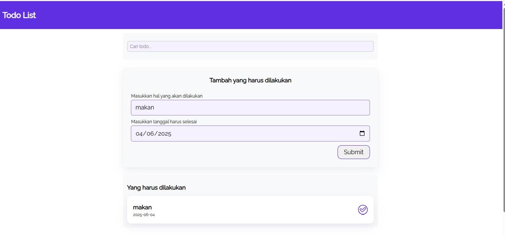

## Pengujian Orthogonal Array Testing

Pengujian Array Ortogonal (OAT) adalah teknik pengujian perangkat lunak yang
menggunakan array ortogonal untuk membuat kasus uji. Ini adalah pendekatan
pengujian statistik yang sangat berguna ketika sistem yang akan diuji memiliki input
data yang besar. Pengujian susunan ortogonal membantu memaksimalkan cakupan
pengujian dengan memasangkan dan menggabungkan input serta menguji sistem dengan
jumlah kasus pengujian yang relatif lebih sedikit untuk menghemat waktu

Pada pengujian ini menggunakan software Tode list, yaitu software yang digunakan untuk membuat daftar list kegiatan yang harus dilakukan dalam jangka waktu tertentu. Pada software ini  terdapat dua input yaitu judul (Masukan Hal yang harus dilakukan) dan Tanggal (Masukan tanggal harus selesai). Kemudian ketika data input di submit data akan tersimpan ke memori tanpa menggunakan database. 
Dalam pengujian ini alikasi Todo List dibagi menjadi beberapa tahap pengujian untuk uji Orthogonal Array Testing yaitu , sebagai berikut :

## 1.	Faktor dan Level yang diuji
Pada tahap ini terdapat dua faktor sesui input yang digunakan yaitu Judul  tugas dan Tanggal Deadline, kemudian dibagi menjadi 3 level untuk dilakukan uji:

| Faktor          | Level 1            | Level 2                                   | Level 3    |
|-----------------|--------------------|-------------------------------------------|------------|
| Judul Tugas     | Pendek "Membaca"   | Panjang "Membaca Buku Sejarah Penjajahan" | Kosong     |
| Tanggal Deadline| Tanggal Hari ini   | tanggal mendatang                         | Kosong     |

## 2. Matriks kasus uji
   Berdasarkan faktor dan level uji yang sudah dibuat, maka dapat dilakukan matriks kasus uji yaitu 9 kasuas uji. kasus uji ini dilakukan dengan memasangkan dua faktor dengan beberapa kasus pada level yang berbeda. berikut tabel pengujiannya:
   
|Kasus Uji | Judul Tugas                              | Tanggal Deadline  | Hasil Pengujian                                                   | Hasil         |
|----------|------------------------------------------|-------------------|-------------------------------------------------------------------|---------------|
| 1        |Pendek "membaca"                          | Hari ini          | Sukses tambah tode list, dan muncul di daftar yang harus dilakukan|  |
| 2        |Pendek "membaca"                          | Tanggal mendatang | Sukses tambah tode list, dan muncul di daftar yang harus dilakukan|
| 3        |Pendek "membaca"                          | kosong            | Gagal submit, validasi gagal form tidak dapat menyimpan input data|
| 4        |Panjang "membaca buku sejarah penjajahan" | Hari ini          | Sukses tambah tode list, dan muncul di daftar yang harus dilakukan|
| 5        |Panjang "membaca buku sejarah penjajahan" | tanggal mendatang | Sukses tambah tode list, dan muncul di daftar yang harus dilakukan|
| 6        |Panjang "membaca buku sejarah penjajahan" | kosong            | Gagal submit, validasi gagal form tidak dapat menyimpan input data|
| 7        |kosong                                    | Hari ini          | Gagal submit, validasi gagal form tidak dapat menyimpan input data|
| 8        |kosong                                    | Tanggal Mendatang | Gagal submit, validasi gagal form tidak dapat menyimpan input data|
| 9        |kosong                                    | kosong            | Gagal submit, validasi gagal form tidak dapat menyimpan input data|

---
Pada 9 pengujian tersebut terdapat 4 sukses dan 5 gagal dalam melakukan input data, kegagalan disebebkan karena:
- Judul kosong, karena input required sehingga form harus menolak submit
- Tanggal kosong , karena input required sehingga form harus menolak submit
Kemudian pengujian ini dilakukan dengan menuliskan judul panjang dan penduk hal ini mengecek untuk memastikan aplikasi bisa handle cerita yang panang atau pendek, kemudian pada waktu dilakukan uji pada hari ini dan tanggal mendatang untuk memastikan tanggal yang valid diterima.
---
