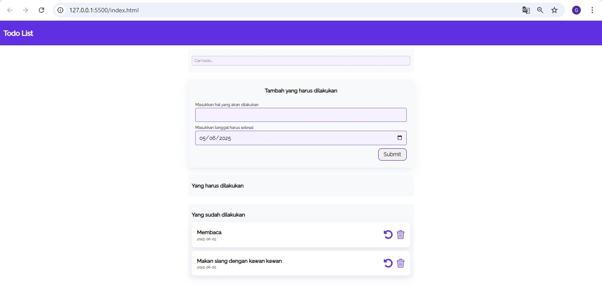
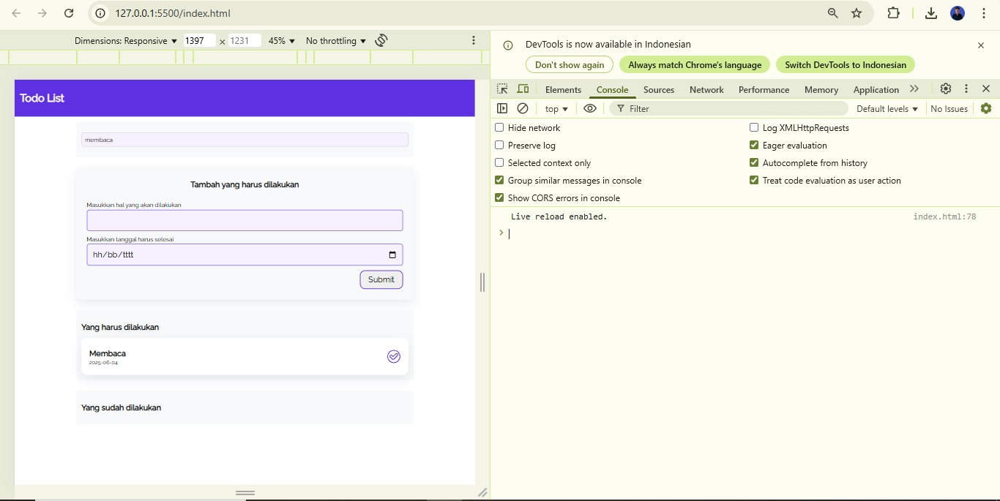

Regression Testing adalah teknik pengujian perangkat lunak yang berfokus pada
memastikan bahwa perubahan yang dilakukan pada kode program tidak
menyebabkan bug atau masalah baru pada fungsionalitas yang sudah ada. Teknik ini
penting untuk menjaga stabilitas dan kualitas perangkat lunak selama proses
pengembangan.

---

## 1. Menambahkan fitur baru
pada pengujain ini diilakukan penambahan fitur untuk menguji apakah aplikasi tetap berjalan dengan baik dengan penambahan fitur tersebut, fitur yang ditambahkan yaitu fitur pencarian (search).
Berikut ini adalah tampilan input pencarian pada aplikasi:

Fitur pencarian (search) telah ditambahkan ke aplikasi Todo List agar pengguna dapat dengan mudah menemukan tugas tertentu berdasarkan kata kunci. Fitur ini memfilter daftar tugas secara real-time saat pengguna mengetik di kolom pencarian. Penambahan dilakukan pada file HTML (input baru) dan file JavaScript (fungsi filterTodos() dan event listener). Fitur ini diuji berhasil dan tidak mengganggu fungsi lainnya seperti tambah, hapus, maupun tandai selesai tugas.
Berikut tampilan implementasi pengujian pada penambahan fitur search:
# Before

# After

