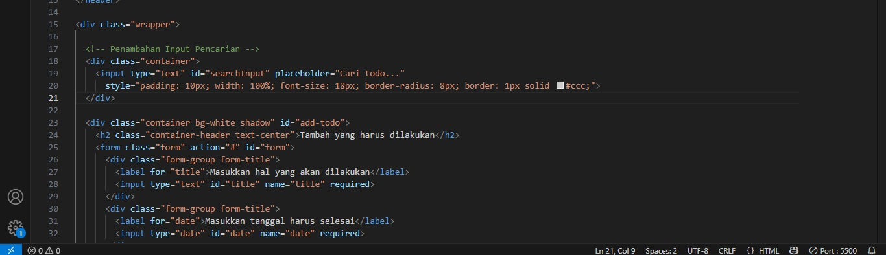

Regression Testing adalah teknik pengujian perangkat lunak yang berfokus pada
memastikan bahwa perubahan yang dilakukan pada kode program tidak
menyebabkan bug atau masalah baru pada fungsionalitas yang sudah ada. Teknik ini
penting untuk menjaga stabilitas dan kualitas perangkat lunak selama proses
pengembangan.

---

## 1. Menambahkan fitur baru
pada pengujain ini diilakukan penambahan fitur untuk menguji apakah aplikasi tetap berjalan dengan baik dengan penambahan fitur tersebut, fitur yang ditambahkan yaitu fitur pencarian (search).
Berikut ini adalah tampilan input pencarian pada aplikasi:

Fitur pencarian (search) telah ditambahkan ke aplikasi Todo List agar pengguna dapat dengan mudah menemukan tugas tertentu berdasarkan kata kunci. Fitur ini memfilter daftar tugas secara real-time saat pengguna mengetik di kolom pencarian. Penambahan dilakukan pada file HTML (input baru) dan file JavaScript (fungsi filterTodos() dan event listener). Fitur ini diuji berhasil dan tidak mengganggu fungsi lainnya seperti tambah, hapus, maupun tandai selesai tugas.
Berikut tampilan implementasi pengujian pada penambahan fitur search:
# Before

# After

## 2. Memperbaiki Bug dan Gangguan
Tidak ditemukan bug fungsional utama sebelum penambahan fitur. Namun, dilakukan code inspection untuk memastikan bahwa input kosong atau tanggal yang tidak valid tetap dicegah melalui atribut required. Pengujian regresi menunjukkan bahwa semua validasi form tetap berjalan sebagaimana mestinya.

Form sudah menerapkan atribut HTML required pada elemen input untuk judul (#title) dan tanggal (#date), yang berarti form tidak dapat disubmit dengan data kosong atau tidak valid. Setelah penambahan fitur pencarian, dilakukan pengujian regresi untuk memastikan validasi ini tetap berjalan normal dan tidak terganggu oleh fitur baru.

Hasil pengujian menunjukkan bahwa seluruh alur aplikasi, termasuk validasi input, rendering data, dan penyimpanan ke localStorage masih berfungsi dengan baik. Dengan demikian, tidak ada regresi atau gangguan pada fungsionalitas yang sudah ada.

## 3. Mengubah Infrastruktur

Pada tahap penambahan fitur pencarian (search), dilakukan perubahan kecil pada struktur HTML dan JavaScript sebagai bagian dari pengujian regresi terhadap infrastruktur aplikasi. Berikut adalah alur perubahan dan validasinya:

Perubahan HTML (Struktur Tampilan)
Elemen *<input type="text" id="search" placeholder="Cari tugas...">*  ditambahkan di luar elemen <form> agar tidak ikut tersubmit saat pengguna menekan Enter.

Posisi elemen search diletakkan sebelum daftar todo untuk kenyamanan pengguna.

Karena elemen search tidak termasuk form, maka tidak terjadi konflik dengan mekanisme submit form bawaan.

Perubahan JavaScript (Struktur Logika)
Ditambahkan *addEventListener('input', ...)* pada elemen *#search* untuk menangkap input real-time.

Ditambahkan fungsi filterTodos(keyword) yang memfilter array todos berdasarkan kata kunci pencarian (dengan pencocokan terhadap judul tugas).

Fungsi ini dipanggil bersamaan dengan RENDER_EVENT, namun tidak memodifikasi fungsi utama seperti:

addTodo()

removeTaskFromCompleted()

saveData()

💾 Validasi LocalStorage
LocalStorage (TODO_APPS) tetap menyimpan data todo sesuai format lama tanpa perubahan struktur data.

Tidak ada konflik penyimpanan atau duplikasi data akibat fitur baru karena pencarian hanya dilakukan pada tampilan (client-side filtering), bukan manipulasi data utama.

✅ Hasil Pengujian
Alur CRUD (Create, Read, Update, Delete) todo masih berfungsi normal.

Fungsi pencarian tidak mengubah state data asli.

Tidak ditemukan regresi, crash, atau efek samping negatif dari penambahan struktur elemen dan fungsi baru.

